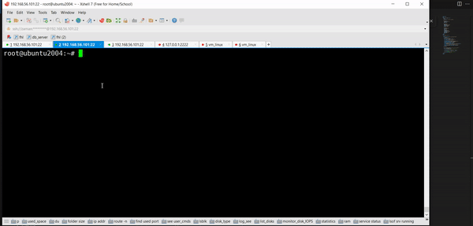

In this project our objective is:

1.  Create two namespaces in Linux, connect with bridge and ping from one namespace to another
2.  Visualize packet passing through bridge in web browser using NodeJS, Express JS. Set up an HTTP server with an Express application, create a WebSocket server, spawns a tcpdump process to capture packets, and use WebSockets to stream the captured packets to connected clients in real-time.

DEMO: https://youtu.be/wphwHzcoucM

This file is being updated...
