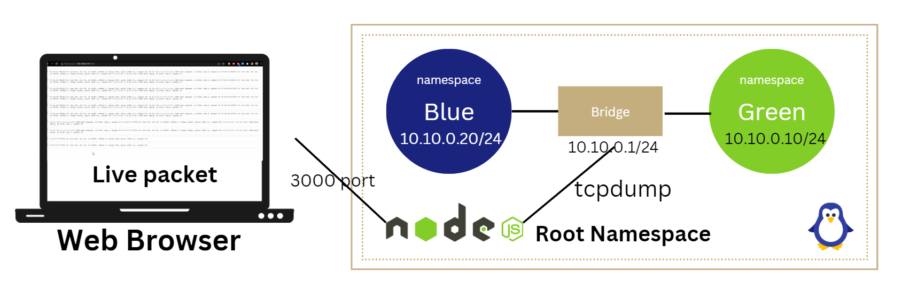

DEMO: https://youtu.be/wphwHzcoucM

**Table of Contents**:

**1. Objective**

**2. Creating Namespaces and Connecting to the Bridge**

2.1. Setting up the VM and Creating Namespaces

2.2. Connecting Namespaces with vETH Cables

2.3. Assigning IP Addresses to Namespace Interfaces

2.4. Creating and Connecting the Bridge

2.5. Configuring Default Routes for Namespace Traffic

**3. Pinging Between Namespaces**

3.1. Verifying Connectivity: Ping from GREEN to BLUE

**4. Setting up the Application for Real-time Packet Capture**

4.1. Installing Node.js and Required Modules

4.2. Creating the Express Application and WebSocket Server

4.3. Handling WebSocket Connections and Spawning tcpdump

4.4. Event Listeners for tcpdump Process

4.5. Starting the Server

**5. Frontend HTML Page and WebSocket Communication**

5.1. HTML Structure

5.2. JavaScript Code for WebSocket Connection

5.3. Formatting and Displaying Captured Packets

**6. Conclusion**

Objectives:

-   Create two namespaces in Linux, connect with bridge and ping from one namespace to another
-   Visualize packet passing through bridge in web browser using NodeJS, Express JS. Set up an HTTP server with an Express application, create a WebSocket server, spawns a tcpdump process to capture packets, and use WebSockets to stream the captured packets to connected clients in real-time.
