In this project our objective is:

1.  Create two namespaces in Linux, connect with bridge and ping from one namespace to another
2.  Visualize packet passing through bridge in web browse using NodeJS, Express JS. Set up an HTTP server with an Express application, create a WebSocket server, spawns a tcpdump process to capture packets, and use WebSockets to stream the captured packets to connected clients in real-time.

Create a bridge and connect two namespaces

We will use vagrant to create a VM and create two namespaces inside the VM.

First, we will initialize ubuntu 22.04 VM.

vagrant init generic/ubuntu2204

Vagrant configuration file will be generated in the directory. We will update the file

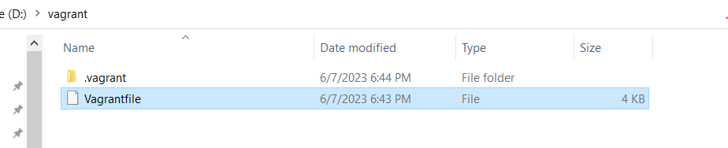

We will use virtual box as VM provider and enable the GUI mode. We have set the memory size 1024 MB.

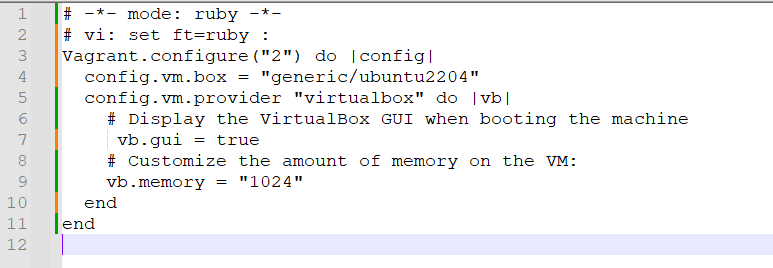

vagrant up  
vagrant ssh

Now up the VM using vagrant up and after this to login the VM do vagrant ssh.

Let’s become root user.

Sudo su -

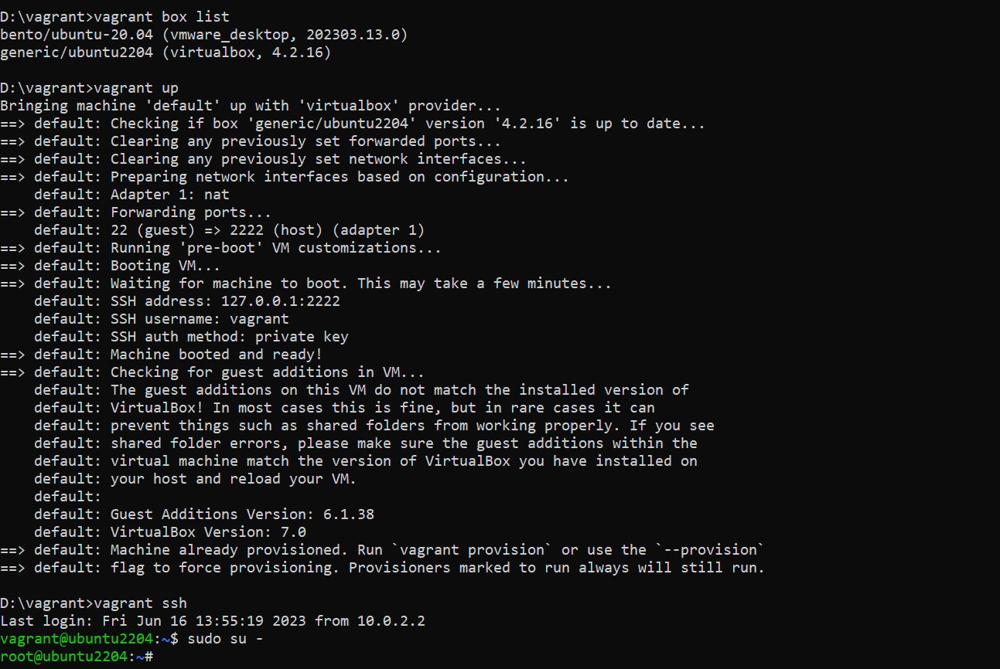

To exit from the VM and shutdown:

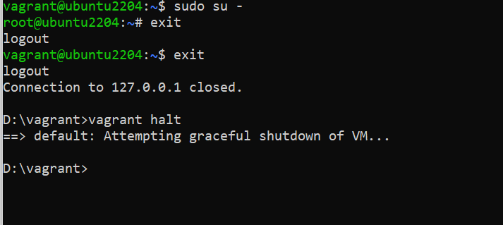

Now that we have created the VM, and logged in in root mode lets create two namespaces BLUE and GREEN.

ip netns add green

ip netns add blue

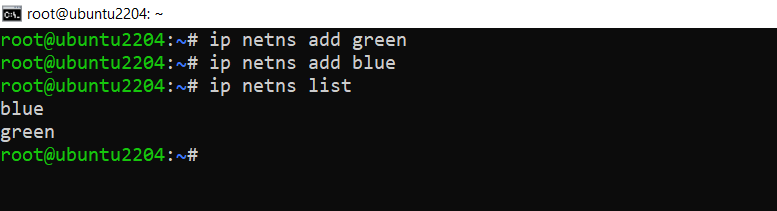

To establish connectivity between these namespaces and our host network, we utilize the vETH (virtual Ethernet) device. This device acts as a local Ethernet tunnel and is created in pairs. When packets are transmitted on one device within the pair, they are promptly received on the other device. If either device becomes down, the link state of the pair is also considered down.

Let us create two veth cables and connect the namespaces with host.

Consider VETH as analogous to a network cable. One end of the cable is connected to the host network, while the other end is connected to the newly created network namespace.

Now, let's proceed with connecting the cable and bringing these interfaces online.

We will create two cables veth1 and veth2.

ip link add veth1 type veth peer name vpeer1

ip link add veth2 type veth peer name vpeer2

Now up the cable.

\# setup veth link

ip link set veth1 up  
ip link set veth2 up

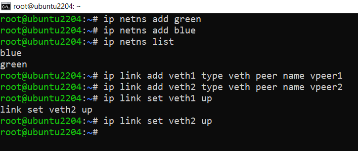

We will up the loopback interface of each namespace.

ip netns exec green ip link set lo up

ip netns exec blue ip link set lo up

We will attach the other end of the cable to respective namespaces.

\# add peers to ns  
ip link set vpeer1 netns green  
ip link set vpeer2 netns blue

Now we will up the device of each namespace and assign ip addresses.

ip netns exec green bash

ip link set vpeer1 up

ip addr add 10.10.0.10/16 dev vpeer1

ip addr show

exit

For blue:

ip netns exec blue bash

ip link set vpeer2 up

ip addr add 10.10.0.20/16 dev vpeer2

ip link show

exit

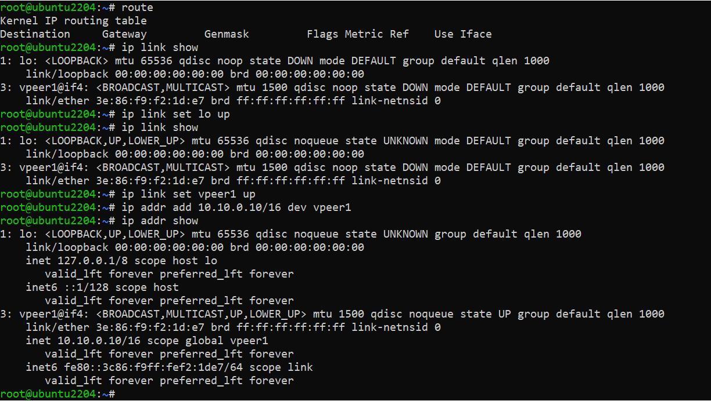

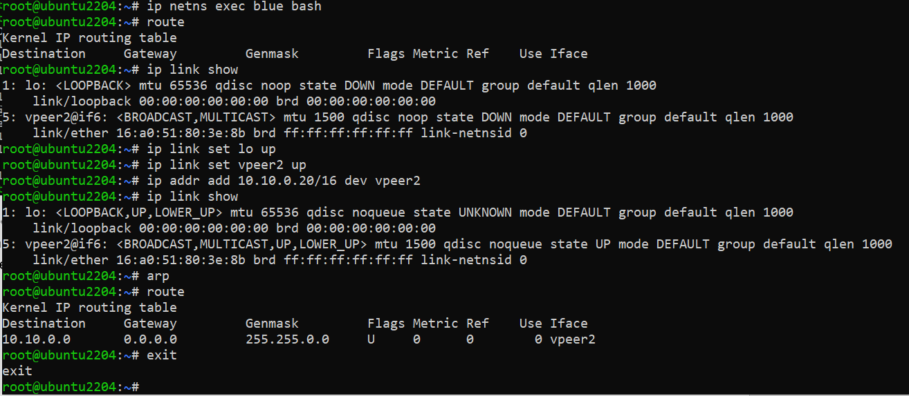

Just to recap, in this scenario, we have assigned network addresses only to the interfaces within the network namespaces (ns1/vpeer1 and ns2/vpeer2). However, the interfaces in the host namespaces (veth1 and veth2) do not have an assigned IP address. Why is that the case? The reason is that it is not actually necessary for our current purpose.

We will create a bridge and connect the other end of those cable with the bridge.

\# setup bridge  
ip link add br_dev type bridge  
ip link set br_dev up

\# assign veth pairs to bridge  
ip link set veth1 master br_dev  
ip link set veth2 master br_dev

\# setup bridge ip  
ip addr add 10.10.0.1/16 dev br_dev

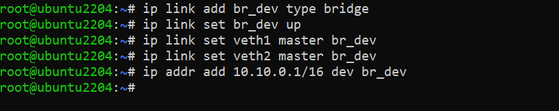

Once our network interfaces are connected to the bridge, a question arises: how do these interfaces determine the path for directing the traffic to the host? In the route tables of both network namespaces, there are only route entries for their specific subnet IP ranges.

However, as we have established the connection of the VETH pairs to the bridge, the bridge network address becomes accessible to these network namespaces. To enable the desired traffic flow, we can add a default route that directs the traffic to the bridge.

\# add default routes for ns  
ip netns exec green ip route add default via 10.10.0.1  
ip netns exec blue ip route add default via 10.10.0.1

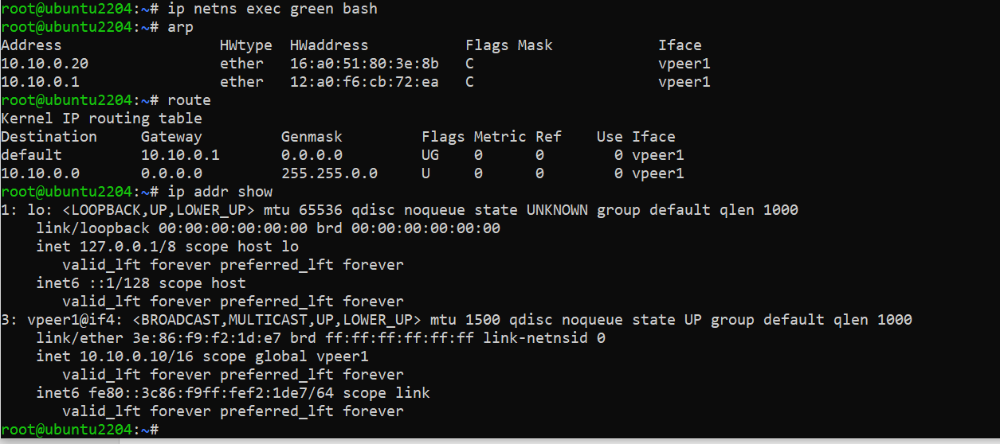

Let’s ping to the BLUE namespace from GREEN namespace now.

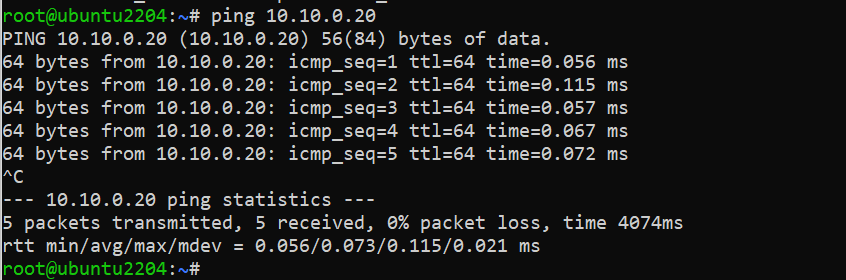

Successfully GREEN can ping BLUE via bridge.

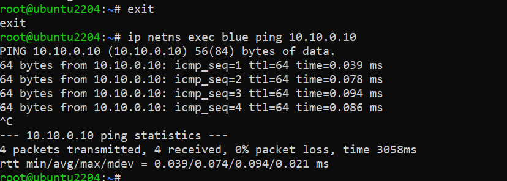

BLUE can also ping to GREEN.

We have done our first goal. Now we will install NodeJS, npm, express js and develop our application that will show packets passing through the bridge in real time.

# Installation of Node.js on Linux

sudo apt-get update

sudo apt-get upgrade

sudo apt-get install python-software-properties

Add Node.js PPA to the system.

curl -sL https://deb.nodesource.com/setup_10.x \| sudo -E bash –

apt install nodejs

node -v or node –version

sudo apt install npm

npm -v or npm –version

npm init

npm install express

npm install ws

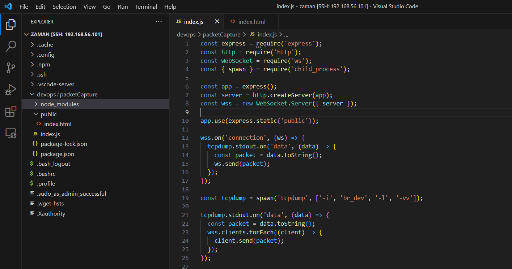

In this index.js file, first importing required modules.

-   express for creating the Express application.
-   http for creating an HTTP server.
-   ws for creating a WebSocket server.
-   child_process for spawning a child process (tcpdump)

**Creating the Express application, HTTP server, and WebSocket server:**

-   express() creates the Express application.
-   http.createServer(app) creates an HTTP server using the Express application.
-   new WebSocket.Server({ server }) creates a WebSocket server using the HTTP server.

app.use(express.static('public')) serves static files from the "public" directory.

**Handling WebSocket connections:**

-   wss.on('connection', (ws) =\> { ... }) listens for WebSocket connections.
-   When a client connects, it sets up a listener on the stdout of the tcpdump process.
-   Whenever tcpdump outputs data (captured packets), it sends the packet to the connected client through the WebSocket.

**Spawning the tcpdump process:**

-   const tcpdump = spawn('tcpdump', ['-i', 'br_dev', '-l', '-vv']) spawns the tcpdump command as a child process.
-   The -i br_dev option specifies the network interface to capture packets from.
-   The -l option enables line buffering for immediate output.
-   The -vv option enables verbose output.
-   The stdout of the tcpdump process is read and sent to all connected WebSocket clients.
-   The stderr of the tcpdump process is monitored for any error messages.

**Event listeners for tcpdump process:**

-   tcpdump.stdout.on('data', (data) =\> { ... }) listens for data output from the tcpdump process.
-   The captured packet is converted to a string and sent to all connected WebSocket clients.
-   tcpdump.stderr.on('data', (data) =\> { ... }) listens for any error data from the tcpdump process.
-   tcpdump.on('close', (code) =\> { ... }) listens for the process close event and logs the exit code.

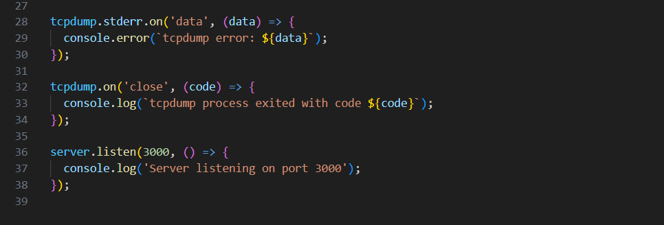

**Starting the server:**

server.listen(3000, () =\> { ... }) starts the server and listens on port 3000.

It logs a message to the console when the server starts successfully.

HTML page:

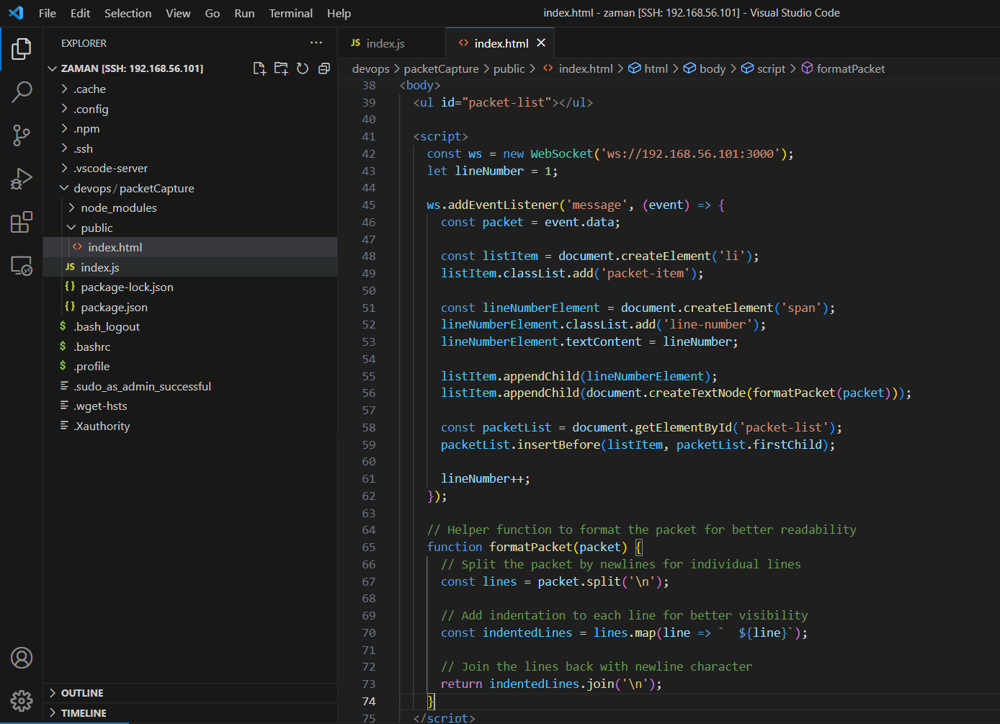

In the frontend there is a JavaScript script that runs on a web page. It sets up a WebSocket connection to a server at the address ws://192.168.56.101:3000. It listens for incoming messages from the WebSocket server and performs some actions when a message is received.

When a message is received, the code creates a new list item (\<li\>) element and assigns it the class packet-item. It also creates a \<span\> element for the line number and assigns it the class line-number. The line number is initialized as 1.

The received packet data is then appended to the list item element after being formatted for better readability using the formatPacket helper function. The formatted packet text is added as a text node to the list item.

The code finds the \<ul\> element with the ID packet-list in the HTML document and inserts the newly created list item at the beginning of the list using packetList.insertBefore(listItem, packetList.firstChild).

Finally, the line number is incremented to keep track of the packet order.

There is also a formatPacket function defined as a helper. This function takes the received packet as input and performs the following steps:

-   The packet is split into individual lines using the newline character (\\n).
-   Indentation is added to each line by prefixing two spaces ( ) to enhance visibility.
-   The indented lines are joined back together using the newline character (\\n).
-   The formatted packet is returned as a single string.
