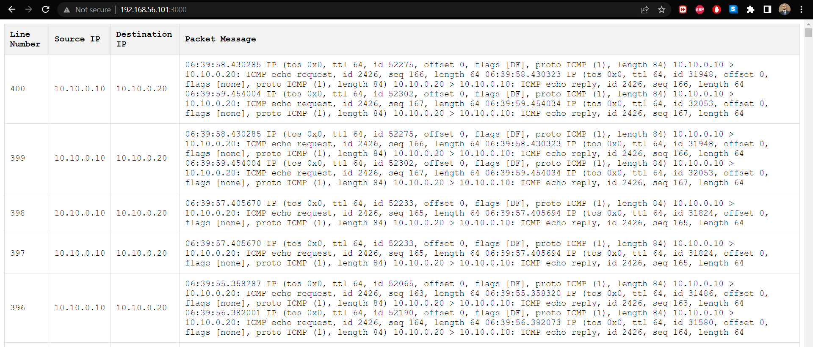

DEMO: https://youtu.be/wphwHzcoucM

**Table of Contents**:

**1. Objective**

**2. Creating Namespaces and Connecting to the Bridge**

2.1. Setting up the VM and Creating Namespaces

2.2. Connecting Namespaces with vETH Cables

2.3. Assigning IP Addresses to Namespace Interfaces

2.4. Creating and Connecting the Bridge

2.5. Configuring Default Routes for Namespace Traffic

**3. Pinging Between Namespaces**

3.1. Verifying Connectivity: Ping from GREEN to BLUE

**4. Setting up the Application for Real-time Packet Capture**

4.1. Installing Node.js and Required Modules

4.2. Creating the Express Application and WebSocket Server

4.3. Handling WebSocket Connections and Spawning tcpdump

4.4. Event Listeners for tcpdump Process

4.5. Starting the Server

**5. Frontend HTML Page and WebSocket Communication**

5.1. HTML Structure

5.2. JavaScript Code for WebSocket Connection

5.3. Formatting and Displaying Captured Packets

Objectives:

-   Create two Linux namespaces and establish a connection between them using a bridge. Verify connectivity by pinging between the namespaces.
-   Develop a web-based visualization to monitor packet flow through the bridge using Node.js and Express.js. This involves setting up an HTTP server with an Express application, creating a WebSocket server, spawning a tcpdump process to capture packets, and streaming the captured packets in real-time to connected clients via WebSockets.

**Directory structure:**

[create_namespace_bridge](https://github.com/hasanashik/RealtimeBridgeCapture/tree/main/create_namespace_bridge) This directory contains script to build two namespace, one bridge, create veth cable and connect namespaces with bridge, add default route in the namespace.

[packetCapture](https://github.com/hasanashik/RealtimeBridgeCapture/tree/main/packetCapture) directory contains the NodeJS application script.

**2. Creating Namespaces and Connecting to the Bridge**

2.1. Setting up the VM and Creating Namespaces

We have used vagrant to up the VM.

Commands:

vagrant init generic/ubuntu2204

vagrant up  
vagrant ssh

2.2 to 2.5 are covered in the create_namespace_bridge directory.

For details feel free to read the blog [post](https://autonetmate.com/software/real-time-packet-capture-of-linux-bridge-ping-namespaces-and-display-with-websocket/).

**3. Pinging Between Namespaces**

3.1. Verifying Connectivity: Ping from GREEN to BLUE

**4. Setting up the Application for Real-time Packet Capture**

4.1. Installing Node.js and Required Modules

sudo apt-get update

sudo apt-get upgrade

sudo apt-get install python-software-properties

Add Node.js PPA to the system.

curl -sL https://deb.nodesource.com/setup_10.x \| sudo -E bash –

apt install nodejs

node -v or node –version

sudo apt install npm

npm -v or npm –version

npm init

npm install express

npm install ws

Now clone the project

Git clone <https://github.com/hasanashik/RealtimeBridgeCapture.git>

**Before proceeding to further steps, it is assumed that you have already created namespaces and bridge with name br_dev and ping is working between two namespaces.**

Change directory to packetCapture and run the NodeJS project using

Node index.js

Optionally you can open a new terminal and do tcpdump on br_dev interface using “tcpdump -I br_dev” to see packets passing through the bridge.

\*\*\*NOTE: You need to update the VM localhost ip address in the nodeJS script.

From web browser now go to <http://your_vm_ip:3000/>

After starting the ping from one namespace to another you will now see live packets in the browser.
